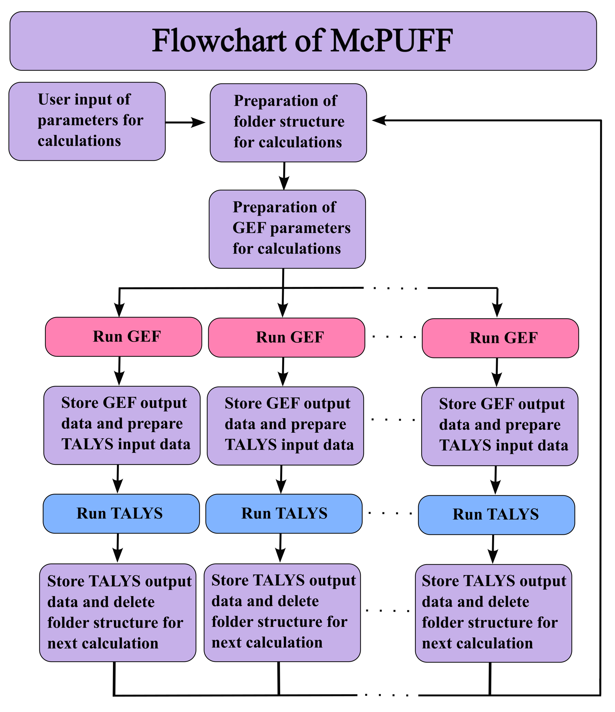

# McPUFF 
$\underline{M}onte$ $\underline{C}arlo$ $\underline{P}ropagation$ $of$ $\underline{U}ncertainties$ $in$ $\underline{F}ission$ $\underline{F}ragments$

## Description

GEF [[1]](#1) and TALYS [[2]](#2) are two computer software programs used to simulate nuclear fission. There is an option called ' fymodel 4 (Okumura) ' in TALYS which makes use of GEF as a fission fragment generator and then simulates the evaporation process using a Hauser-Feshbach method. McPUFF was written to enable the user to perform simulations using the ' fymodel 4 ' option in TALYS but with perturbed parameter values in GEF. The perturbation of the parameter values in GEF, using the built-in function ' MyParameters', introduces uncertainties in the fission observables, which will be passed on to TALYS via the input data. This provides a measure of the sensitivity of the TALYS model to uncertainties in nuclear data. McPUFF performs its simulations using the ' Total Monte Carlo (TMC) ' method, described in reference [[3]](#3), which is a method for handling the propagation of uncertainties in calculations. The implementation of the TMC method requires modifications of the GEF and TALYS softwares, and these modifications are discussed in the ' Overview of the modifications of GEF and TALYS ' section. When performing a simulation using McPUFF, the user provides the necessary information about the simulated fission reaction and can choose the GEF and TALYS input data, which parameters to perturb, the magnitude of the perturbation and which distribution to draw perturbed parameter values from by making choices in a set of separate input files. All results and information about a simulation with McPUFF are stored in a python ' pickle ' file. After a simulation is completed, the pickle file can be loaded and the original object structure of McPUFF can be navigated in order to analyze the results. 

## Table of contents

- Requirements
- Overview of the GEF and TALYS modifications
- Installation
- McPUFF simulation flow chart
- McPUFF object structure
- Features
- License
- References

## Requirements

- numPy
- Matplotlib
- Modified version of TALYS 1.96. TALYS is available for download at available at [TALYS](https://tendl.web.psi.ch/tendl_2021/talys.html). 
- Modified version of GEF version 2023/1.1. GEF is available for download at [GEF](https://www.khschmidts-nuclear-web.eu/GEF.html).

## Overview of the necessary modifications of GEF and TALYS 

- Only one GEF source file needs to be modified, ' ReadParameters.mac '. The list of parameters needs to be extended to encompass all parameters in the GEF source file ' parameters.bas '. This repository contains a modified copy of the GEF source code file [ReadParameters.mac](https://github.com/UPTEC-F-23065/McPUFF/blob/0aba22b49c58036d0ab31036d52f9ad9972be772/ReadParameters.mac), and a pdf-file showing the necessary [GEF Modifications](https://github.com/UPTEC-F-23065/McPUFF/blob/a0ae153531fa13ed95af9f5d99c407b0fbdb05f6/Modifications_of_GEF_for_TMC_simulations.pdf) if the user wants to implement the modifications on their own.
- The necessary modifications for TALYS are described in detail in the GitHub repository [Modification-of-TALYS-for-TMC-simulations ](https://github.com/UPTEC-F-23065/Modification-of-TALYS-for-TMC-simulations.git).

## McPUFF simulation flow chart

A TMC simulation has two sources of uncertainties, one statistical and one systematical. The systematical uncertainty is a measure of the model response to uncertainties in the input data, which is the desired information. In order to reduce the statistical uncertainty, a large number (potentially thousands) of simulations are performed and hence the McPUFF program performs parallel simulations in loops until the desired number of simulations are performed. The user provides the information about the simulated fission reaction at the outset and the rest of the simulation is automated. The figure below shows a schematic of the McPUFF simulations.

## McPUFF object structure

## Installation

## Features

The TMC method requires a large number of simulations to be performed in order to reduce the statistical error and in order to decrease the computation time, McPUFF performs multi-thread calculations in parallel. Results are stored in an object structure and, in order to free up disc space, files and folders used for the calculation are deleted after each calculation is complete.

Saves data for param vals etc

## License

[License](https://github.com/UPTEC-F-23065/Modification_of_TALYS_for_TMC_simulation/blob/0e362615d513a9d40d9e6bad77ce465fc0009aed/LICENSE)

## References

<a id="1">[1]</a>
K.-H. Schmidt, B. Jurado, C. Amouroux, and C. Schmitt. General Description of Fission
Observables: GEF Model Code. Nuclear data sheets, 131:107–221, 2016.

<a id="2">[2]</a>
Arjan Koning, Stephane Hilaire, and Stephane Goriely. TALYS: modeling of nuclear reactions.
The European physical journal. A, Hadrons and nuclei, 59(6), 2023.

<a id="3">[3]</a> 
P. Karlsson. Total Monte Carlo of the fission model in GEF
and its influence on the nuclear evaporation in TALYS.
Technical Report UPTEC F 23065, Uppsala university,
2023, [Link](http://urn.kb.se/resolve?urn=urn:nbn:se:uu:diva-517598). 
Accessed 1 January 2024.
